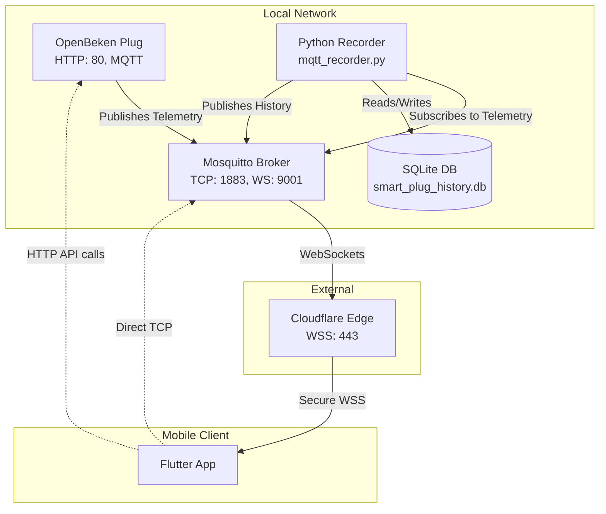

# Smart Plug Ecosystem: Comprehensive Technical Documentation

This document serves as the ultimate technical reference for the **Smart Plug App for OpenBeken Plugs** ecosystem. It provides an exhaustive, in-depth exploration of every feature, function, service, and architectural decision within the project.

---

## 1. System Architecture & Topology

The ecosystem is a highly resilient, multi-protocol IoT solution designed for OpenBeken (or Tasmota) smart plugs. It ensures absolute local control without internet dependency, while providing secure remote access when required.

### 1.1 Core Components
1. **The Smart Plug (Hardware):** Executes OpenBeken firmware. Exposes a local HTTP REST API and an MQTT client.
2. **The Local MQTT Broker (Mosquitto):** The central message bus. Configured with dual listeners: TCP (Port 1883) for local traffic and WebSockets (Port 9001) for tunneled traffic.
3. **The Telemetry Recorder (Python Backend - `mqtt_recorder.py`):** A daemon service that persists live MQTT telemetry to a local SQLite database and serves historical data requests.
4. **The Mobile Application (Flutter - `smart_plug_app`):** The client interface, responsible for state management, UI rendering, device discovery, and dynamic network routing.
5. **The Secure Bridge (Cloudflare Tunnel):** A Zero Trust tunnel exposing the local Mosquitto WebSocket listener to the internet securely.

### 1.2 Architecture Diagram


---

## 2. Network & Connection Management

The application features a dynamic network routing system governed by the `ConnectionManager` (`lib/core/connection_manager.dart`).

### 2.1 Connection Modes
The app fluidly transitions between states based on real-time network conditions:
* **Local Mode:** Triggered when the phone's WiFi SSID matches the configured `localSsid`. The app bypasses MQTT and communicates directly with the plug via HTTP REST (`ApiService`). This offers <50ms latency.
* **Remote Mode:** Triggered when the phone is on WiFi but the SSID does not match the home network. The app attempts to connect directly to the local MQTT broker IP via standard TCP.
* **Global Mode:** A user-toggled override. Forces the app to connect to the Cloudflare Tunnel URL via Secure WebSockets (`wss://`). This allows control from cellular networks anywhere in the world.
* **Offline Mode:** No network connectivity detected.

### 2.2 Permissions & Network Info
`ConnectionManager` uses `permission_handler` to request location permissions, a strict requirement on modern Android/iOS to read the active WiFi SSID via `network_info_plus`.

---

## 3. Flutter Application: Core Services & Providers

The Flutter application is built using a decoupled Service architecture combined with the `Provider` pattern for state management.

### 3.1 Telemetry Provider (`lib/core/telemetry_provider.dart`)
The absolute core of the application. It normalizes data from both HTTP and MQTT into a unified `TelemetryData` model.
* **Polling Engine:** 
  * In Local Mode: Executes HTTP `fetchStatus()` every 5 seconds.
  * In Global Mode: Issues MQTT `/get` commands every 30 seconds to force the plug to broadcast updated energy counters.
* **Data Normalization:** The `TelemetryData.fromJson` factory aggressively parses deeply nested OpenBeken JSON payloads (scanning `StatusSNS`, `Status`, `EnergyStatus`, and `StatusSTS`) to reliably extract Voltage, Current, Power, Energy Counters, Chip Temperature, RSSI, and Relay State.
* **History Management:** Maintains a sliding window of the last 1000 power readings (`powerHistory`). Saves this array to `SharedPreferences` to ensure instantaneous UI rendering on app launch before network sync completes.
* **Optimistic UI Updates:** When toggling the plug, the provider immediately updates the local state and UI before the network confirms the action, eliminating perceived latency.

### 3.2 Discovery Service (`lib/core/discovery_service.dart`)
A highly aggressive, multi-pronged network discovery engine designed to find unconfigured plugs.
* **Track 1: mDNS / Zeroconf:** Uses the `bonsoir` package to listen for `_http._tcp` broadcasts, resolving services with "obk" in the name.
* **Track 2: SSDP / UPnP:** Broadcasts UDP M-SEARCH packets using `upnp_client` and parses XML location URLs for devices identifying as OpenBeken.
* **Track 3: Subnet Sweeping (Fallback):** Determines the phone's subnet and fires asynchronous HTTP GET requests to `http://<ip>/index` across 254 IPs in chunks of 20, scanning the HTML body for OpenBeken signatures.
* **Multicast Locks:** Uses `flutter_multicast_lock` to ensure Android's WiFi stack allows inbound UDP broadcast packets during the scan.

### 3.3 Setup Service (`lib/services/setup_service.dart` & `lib/ui/setup_screen.dart`)
A polished 5-step onboarding flow.
1. **Instruction:** Guides the user to connect to the plug's AP.
2. **Provisioning:** Accepts Home WiFi credentials and sends them to the plug via HTTP.
3. **Discovery Wait:** Triggers the `DiscoveryService` while the plug reboots and connects to the home router.
4. **Manual Override:** Allows manual IP entry and connection testing if auto-discovery is blocked by router isolation.
5. **Finalization:** Writes IP and SSID to the `SettingsService` and routes to the Dashboard.

### 3.4 API Service (`lib/core/api_service.dart`)
Handles direct HTTP communication with the plug.
* **Status Aggregation:** The `fetchStatus()` method fires multiple requests in parallel (`status 8`, `status 11`, `status 5`, `status 2`) to assemble a complete JSON profile of the device.
* **Raw Commands:** Wraps OpenBeken's `cm?cmnd=` endpoint, strictly URL-encoding payloads to prevent malformed requests.

### 3.5 Automation & Safety Service (`lib/core/automation_service.dart`)
A background listener attached to the `TelemetryProvider`.
* **Overload Protection:** Continuously monitors the `power` metric. If wattage exceeds `2500.0W` while the relay is ON, it triggers a critical safety protocol, pushing an alert to the UI and immediately issuing a `turnOff()` command to prevent hardware damage.

### 3.6 MQTT Service (`lib/core/mqtt_service.dart`)
Wraps the `mqtt_client` package.
* **Dynamic Client IDs:** Generates unique IDs (`flutter_client_001_<timestamp>`) on every connection attempt. This completely prevents the notorious MQTT "fighting disconnect loop" caused by stale sessions.
* **WebSocket Security Override:** Explicitly sets `secure = false` when using WebSockets (`useWebSocket = true`). This is critical because the Cloudflare tunnel (`wss://`) terminates SSL at the edge, meaning the underlying Dart socket must be standard HTTP to prevent handshake crashes.

---

## 4. User Interface & Widgets

The UI is built for premium aesthetics and maximum performance, located in `lib/ui/`.

### 4.1 Dashboard Screen (`dashboard_screen.dart`)
The primary view, utilizing a `CustomScrollView` or `SingleChildScrollView` for fluid scrolling.
* **Adaptive Choice Chips:** The usage history selector (`5M`, `1H`, `24H`, `7D`) is wrapped in a `Flexible` -> `FittedBox (BoxFit.scaleDown)`. This elegant layout mathematically scales the buttons down to fit narrower smartphone screens, eliminating horizontal overflow warnings.
* **Connection Badge:** A dynamic pill widget that updates color and text (Green=Local, Blue=Cloud, Purple=Global) based on the `ConnectionManager` state.

### 4.2 Interactive Smooth Line Chart (`_SmoothLineChart`)
Powered by `fl_chart`.
* **Dynamic Time Scaling:** The horizontal scroll width is calculated dynamically based on the selected range (e.g., a `5m` view is 5 screens wide, a `24h` view is 6 screens wide).
* **Data Sorting:** Aggressively sorts timestamps (`a.x.compareTo(b.x)`) before rendering to prevent the chart library from drawing chaotic zig-zag lines if data packets arrive out of order.
* **Styling:** Features a custom gradient fill below the line, rounded stroke caps, and transparent grid lines.

### 4.3 Neumorphic Toggle (`neumorphic_toggle.dart`)
A high-end, animated 3D switch replacing standard UI toggles.
* **Gestures & Animation:** Uses `GestureDetector`, `AnimatedContainer`, and `AnimatedPositioned` to create a physical pressing sensation with dynamic drop shadows that invert based on the relay state.

### 4.4 Schedule Bottom Sheet (`schedule_bottom_sheet.dart`)
Allows users to set one-off timers.
* **Time Calculation:** Compares the selected `TimeOfDay` to `DateTime.now()`. If the time has passed, it intelligently schedules for the next day.
* **Hardware Execution:** Converts the time difference into seconds and issues a native OpenBeken backlog command: `backlog delay_s <seconds>; Power <ON/OFF>`. This ensures the timer executes on the hardware even if the phone loses internet.

### 4.5 Data Visualizers & Formatting
* **Visual Clipping over Ellipsis:** Important UI telemetry blocks (like the Today and Total Energy widgets in `telemetry_cards.dart`) utilize `TextOverflow.clip` paired with `softWrap: false`. Instead of trying to inject ugly ellipses (`...`) when a value exceeds the width of the box, the UI natively truncates visually at the bounding box, preserving a clean aesthetic while implicitly truncating extra decimal places.

---

## 5. Python Telemetry Recorder & Database Logic

The backend service (`mqtt_recorder.py`) provides the missing persistent historical layer for OpenBeken.

### 5.1 SQLite Schema & Operations
* **Schema:** `(timestamp REAL, topic TEXT, payload TEXT)`
* **Log Filtering:** The `log_to_db` function intentionally ignores topics containing `/history/` to prevent infinite feedback loops. It attempts to parse `payload` as a float before insertion; strings or malformed data are silently dropped.

### 5.2 Dynamic Query Aggregation
When the app publishes to `dubai-plug-test-123/history/req` (e.g., `{"range": "24h"}`), the `get_history()` function executes:
1. **Time Filtering:** Calculates the Unix epoch `since` boundary.
2. **Topic Filtering:** Queries only topics `LIKE '%power%'` but explicitly excludes `%power_factor%` to ensure pure wattage data.
3. **Bucketing Algorithm:** If an interval is specified (e.g., 300 seconds for `24h`), it groups timestamps using floor division `(ts // interval) * interval` and calculates the arithmetic mean of the power values in that bucket.
4. **Publishing:** The highly compressed dataset is serialized to JSON and published to the `/history/res` topic, triggering the Flutter app to redraw the chart.

---

## 6. Data Processing & Energy Analytics

A core goal of the application is absolute precision when tracking power and historical energy usage. OpenBeken firmware reports its counters natively in Watt-hours (Wh). The application retains this precision without artificial conversion scaling.

### 6.1 Distinction of Day-to-Day Energy Tracking
* **The Daily Energy Chart (`daily_energy_chart.dart`):** Accurately renders a 4-bar visualization contrasting Today, Yesterday, 2 Days Ago, and 3 Days Ago energy consumption. 
* **Native Value Retention:** The `TelemetryProvider` retrieves raw metrics directly from the device (e.g. via `energycounter_today` and `energycounter_yesterday`). Because these values are natively generated by the OpenBeken firmware in **Wh**, the app no longer multiplies them by `1000` (which is typically required for Tasmota `kWh` conversions). This eliminates magnitude errors, allowing the app to render accurate values like `26.000 Wh` instead of `26,000.000 Wh`.
* **Computed Fallbacks:** If the direct `energycounter_today` API fails, the system provides a robust fallback computation: `(_data.energyTotal - _data.energyYesterday)`.

### 6.2 Unit Formatting
* **Today Energy:** Shown in Watt-hours (Wh) via the UI, formatted natively to a maximum of 2 decimal spaces (`#,##0.00`).
* **Total Historic Energy:** Translated safely into Kilowatt-hours (kWh) via dynamic division (`data.energyTotal / 1000`) ensuring users aren't inundated with massively long numbers in the historic metrics block.

---

## 7. Operational Configuration

### Mosquitto Configuration (`local.conf`)
Required to allow the app to connect locally via TCP and remotely via Cloudflare WebSockets.
```ini
listener 1883 0.0.0.0
protocol mqtt
allow_anonymous true

listener 9001 0.0.0.0
protocol websockets
allow_anonymous true
```

### Starting the Ecosystem

**Recommended:** Open the **BKH** workspace in Cursor/VS Code, choose **Smart Plug App (Phone + Backend)**, press **F5** or **Ctrl+F5**. This stops any leftover backend processes, starts fresh Mosquitto, Cloudflare tunnel, and `mqtt_recorder.py`, then launches the Flutter app.

See **[GLOBAL_SETUP.md](GLOBAL_SETUP.md)** for app settings (plug IP, MQTT topic, Cloudflare `wss://…/mqtt` URL).

**Manual:**
1. **Broker:** `mosquitto -c local.conf -v`
2. **Tunnel:** `cloudflared tunnel --url http://localhost:9001`
3. **Recorder:** `python mqtt_recorder.py` (set `MQTT_TOPIC_PREFIX` to your plug’s client topic)
4. **App:** Set **Global bridge URL** in Connection settings to `wss://<tunnel-host>.trycloudflare.com/mqtt` (from the tunnel terminal or `tunnel.url`).
